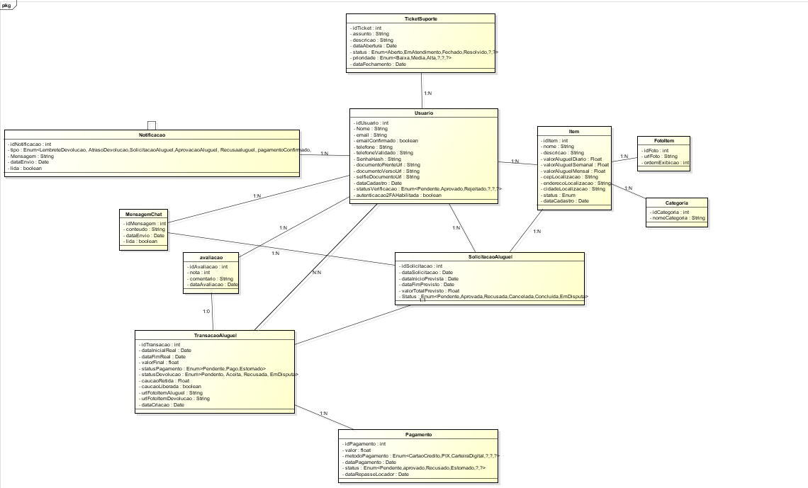

# 02 · AlugApp

> Plataforma de **aluguel de itens entre pessoas**: em vez de comprar algo que vai usar poucas vezes, a pessoa aluga de quem já tem — pagando menos e movimentando a economia local.


🌐 **Aplicação no ar:** https://alugapp.vercel.app/
📁 **Repositório oficial do grupo:** https://github.com/AlugApp/AlugApp

| Contexto | Detalhe |
|---|---|
| Instituição | Centro Universitário de Brasília (CEUB) — Ciência da Computação |
| Disciplinas | Projeto Integrador I → Projeto Integrador IV (projeto contínuo) |
| Tipo | Projeto em grupo |
| Equipe | Cauã Paniagua · Lucas Carmona · Mateus Joaquim · **Pedro Emílio** |

> ℹ️ O código-fonte fica no repositório oficial do grupo. Esta pasta documenta o projeto no meu portfólio e destaca a minha participação, sem duplicar o código.

## 📋 Descrição

O **AlugApp** conecta pessoas para que possam alugar itens entre si — ferramentas, equipamentos esportivos, eletrônicos e outros. Qualquer usuário pode ser, ao mesmo tempo, **locador** (quem disponibiliza o item) e **locatário** (quem aluga).

## 🎯 Problema e objetivo

Muitos itens são comprados para serem usados uma ou duas vezes e depois ficam parados. O AlugApp busca:

- **reduzir custos** para quem precisa de um item por pouco tempo;
- **gerar renda** para quem tem itens subutilizados;
- **diminuir o desperdício** e o consumo desnecessário;
- **fortalecer o compartilhamento** dentro da comunidade.

## ⚙️ Principais funcionalidades

- Cadastro e login com e-mail/senha e **Google OAuth**, recuperação de senha e **MFA**.
- Listagem de itens com **busca** e **filtros** por categoria, preço e período.
- Anúncio de itens com foto e valores por **dia, semana e mês**.
- **Solicitação de aluguel** com fluxo de status (pendente → aprovada → concluída).
- **Chat em tempo real** entre locador e locatário, com fotos de vistoria.
- **Dashboard** com estatísticas do usuário.
- **Painel de administração (RBAC)**: moderação de anúncios e usuários, preços e descontos.
- Versão **Android** empacotada com Capacitor.

## 🛠️ Tecnologias

| Camada | Tecnologia |
|---|---|
| Front-end | React 19 + **TypeScript** |
| Estilização | Tailwind CSS |
| Back-end (BaaS) | **Supabase** — PostgreSQL, Auth, Storage e Realtime |
| Deploy | **Vercel** |
| Mobile | Capacitor (Android) |
| Versionamento e colaboração | **Git + GitHub** (branches e Pull Requests) |
| APIs externas | ViaCEP (endereço) e Disify (validação de e-mail) |

## 🧩 Modelagem

Diagrama de classes do sistema (usuários, itens, solicitações, transações, pagamentos, chat e avaliações):



## 👨‍💻 Minha participação

Algumas entregas que fiz no projeto, registradas no histórico do repositório:

| Entrega | O que envolveu |
|---|---|
| **Dashboard e solicitação de aluguel** | Tela de dashboard com estatísticas, fluxo de solicitação de aluguel, primeira versão do chat e barra de navegação inferior (`Dashboard.tsx`, `Chat.tsx`, `BottomNav.tsx`). |
| **Recuperação de senha e "Meus anúncios"** | Telas de recuperar/redefinir senha, edição de itens e listagem dos anúncios do usuário (`RecuperarSenha.tsx`, `RedefinirSenha.tsx`, `EditarItem.tsx`, `MeusAnuncios.tsx`). |
| **Documentação** | Atualizações do `README.md` do projeto. |

## 🤝 Como o grupo trabalha com Git

- Cada integrante desenvolve em sua **branch** e integra à `main` por **Pull Request**.
- O deploy na **Vercel** é atualizado a partir do repositório.
- Documentação técnica completa no próprio repositório (`DOCUMENTACAO.md`).

## ▶️ Como executar

```bash
git clone https://github.com/AlugApp/AlugApp.git
cd AlugApp
npm install
# crie um arquivo .env com REACT_APP_SUPABASE_URL e REACT_APP_SUPABASE_TOKEN
npm start   # abre em http://localhost:3000
```

## 📚 Aprendizados

- Trabalhar em equipe por vários semestres no mesmo código, com branches, Pull Requests e resolução de conflitos.
- Usar um **BaaS** (Supabase) para autenticação, banco de dados, armazenamento e tempo real.
- Modelar um fluxo de negócio real (solicitação → aprovação → aluguel → devolução).
- Publicar e manter uma aplicação em produção na Vercel.

## 🔜 Próximos passos

- [ ] Pagamentos integrados
- [ ] Histórico de aluguéis
- [ ] Avaliação pós-aluguel
- [ ] Notificações push

[← Voltar aos projetos acadêmicos](../README.md)
