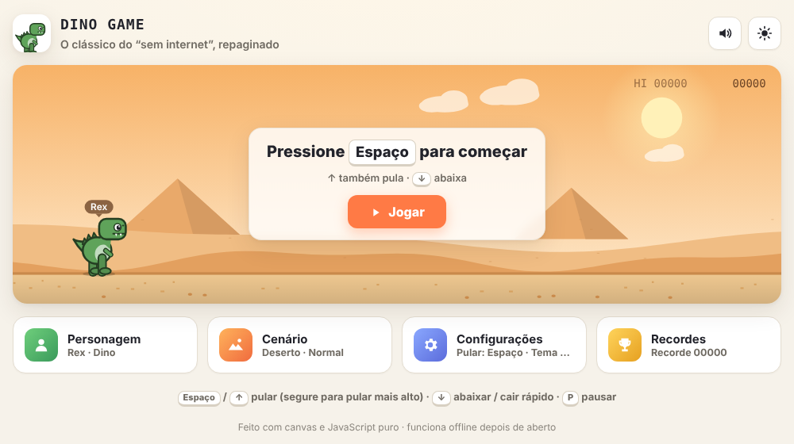
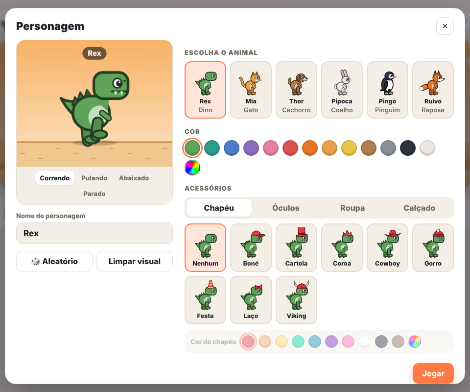
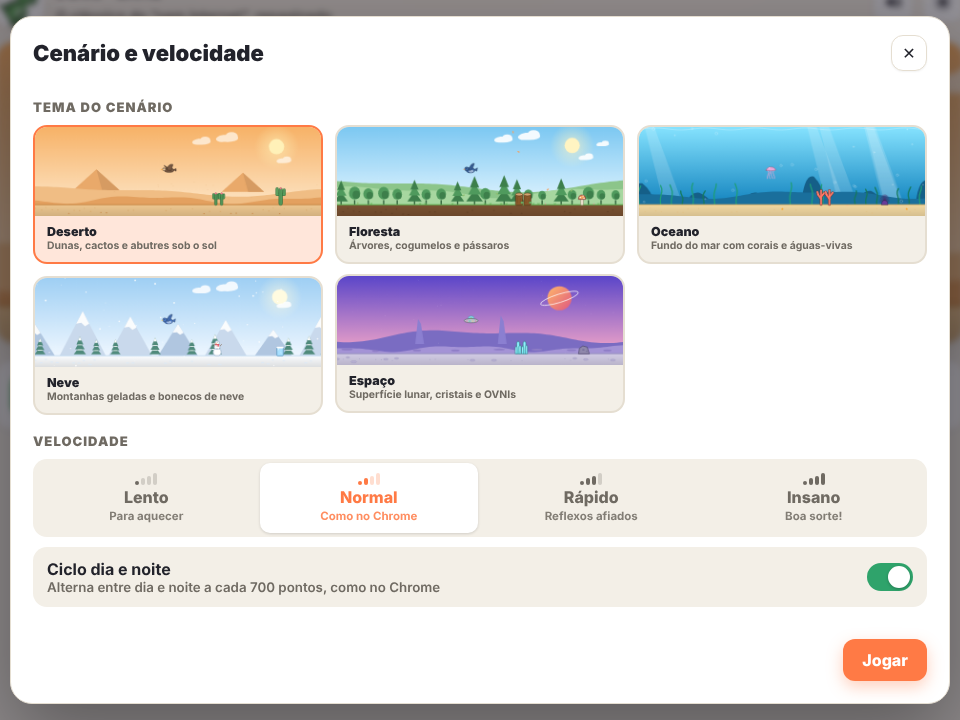

# 01 · Dino Game 2.0

> O clássico jogo do dinossauro do Google Chrome — aquele de quando você fica sem internet — **repaginado** com visual novo e muita personalização.


🎮 **Jogar agora:** https://pedroemiliogea.github.io/dino-game/
📁 **Repositório:** https://github.com/PedroEmilioGea/dino-game



## 📋 Descrição

Projeto pessoal que recria o jogo offline do Chrome como uma **versão 2.0**: além de correr e pular obstáculos, o jogador pode **estilizar o personagem**, escolher **cenários**, ajustar **velocidade**, **aparência** e **efeitos sonoros**, e acompanhar seus **recordes**.

Tudo é desenhado com **Canvas 2D** e **JavaScript puro**, sem imagens, bibliotecas ou frameworks — e funciona offline depois de aberto.

## ⚙️ Funcionalidades

### 🧑‍🎨 Personalização do personagem
- **6 personagens:** Dino, Gato, Cachorro, Coelho, Pinguim e Raposa — cada um com nome próprio.
- **Nome personalizado** exibido acima do personagem durante a corrida.
- **Cores** para o corpo e para cada acessório (incluindo cor personalizada).
- **Acessórios:**
  - Chapéu — boné, cartola, coroa, cowboy, gorro, festa, laço, viking
  - Óculos — escuros, redondos, nerd, estrela, máscara de herói
  - Roupa — camiseta, listrada, colete, capa, cachecol, gravatinha, gravata
  - Calçado — tênis, cano alto, botas, patins
- Botões **Aleatório** e **Limpar visual**.



### 🏞️ Cenários e velocidade
- **5 cenários**, cada um com obstáculos e inimigo voador próprios: Deserto, Floresta, Oceano, Neve e Espaço.
- **4 velocidades:** Lento, Normal, Rápido e Insano — e a velocidade aumenta aos poucos, como no Chrome.
- **Ciclo dia e noite** a cada 700 pontos (opcional).



### 🛠️ Configurações
- **Tema** claro, escuro ou automático (segue o sistema).
- **Teclas configuráveis:** pular, pular (alternativa), abaixar e pausar.
- **Efeitos sonoros** gerados na hora com Web Audio API (sem arquivos de áudio), com botão de mudo.

### 🏆 Recordes
- **Top 10 local** com personagem, cenário, velocidade e data de cada partida.
- Recordes e preferências salvos no navegador (`localStorage`).

### 📱 Celular
- Toque para pular e botões de **Pular/Abaixar** na tela.

## 🎮 Controles padrão

| Ação | Tecla |
|---|---|
| Pular (segure para pular mais alto) | `Espaço` ou `↑` |
| Abaixar / cair mais rápido | `↓` |
| Pausar | `P` ou `Esc` |
| Reiniciar após o game over | `Espaço` ou `Enter` |

## 🛠️ Tecnologias

| Tecnologia | Uso |
|---|---|
| **HTML5** | Estrutura da página e diálogos (`<dialog>`) |
| **CSS3** | Interface, tema claro/escuro e layout responsivo |
| **JavaScript (ES6+)** | Motor do jogo, física, colisão, pontuação e menus |
| **Canvas 2D** | Desenho vetorial de personagens, acessórios e cenários |
| **Web Audio API** | Efeitos sonoros sintetizados |
| **localStorage** | Configurações e recordes |
| **GitHub Pages** | Publicação do jogo |

## 📁 Estrutura

```text
dino-game/
├── index.html          # página do jogo
├── css/style.css       # visual da interface (claro/escuro)
├── js/
│   ├── utils.js        # funções auxiliares (cores, formas, teclas)
│   ├── characters.js   # personagens e acessórios (desenho vetorial)
│   ├── themes.js       # cenários, obstáculos e paletas dia/noite
│   ├── storage.js      # configurações e recordes (localStorage)
│   ├── audio.js        # efeitos sonoros (Web Audio)
│   ├── game.js         # motor do jogo: física, colisão, pontuação
│   └── ui.js           # menus, personalização e controles
└── assets/favicon.svg
```

O código foi separado em **módulos por responsabilidade** (personagens, cenários, áudio, armazenamento, motor e interface), somando cerca de 3.200 linhas.

## ▶️ Como executar

```bash
git clone https://github.com/PedroEmilioGea/dino-game.git
cd dino-game
# abra index.html no navegador — não precisa instalar nada
```

Ou jogue direto pelo GitHub Pages: https://pedroemiliogea.github.io/dino-game/

## 📚 Aprendizados

- Criar um **game loop** com física de pulo, gravidade, colisão e aumento progressivo de dificuldade.
- Desenhar gráficos **vetoriais com Canvas 2D**, sem depender de imagens.
- Gerar **sons sintetizados** com a Web Audio API.
- Organizar um projeto JavaScript maior em **módulos** com responsabilidades claras.
- Persistir dados no navegador e publicar um jogo com **GitHub Pages**.

## 🔜 Próximos passos

- [ ] Ranking online entre jogadores
- [ ] Novos personagens e cenários
- [ ] Conquistas e itens desbloqueáveis

## 👤 Autor

**Pedro Emílio Gêa Gontijo Martins** · [GitHub](https://github.com/PedroEmilioGea) · [LinkedIn](https://www.linkedin.com/in/pedro-em%C3%ADlio-g%C3%AAa-gontijo-martins-45b3a32ba/)

[← Voltar aos projetos pessoais](../README.md)
